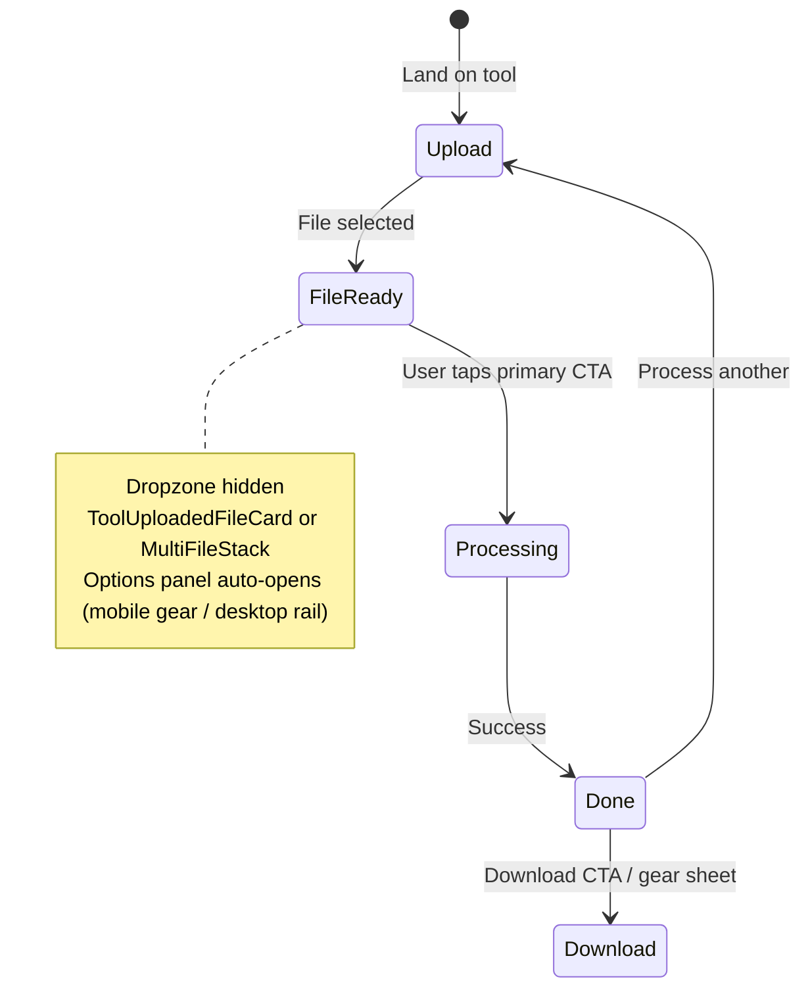

# PDFTrusted UX Bug Fix & UI Stability Plan

**Scope:** Frontend only — no backend, API, processing, or AI pipeline changes.  
**Date:** 2026-05-30

---

## 1. Bug fix implementation plan

| Bug | Root cause | Fix | Status |
|-----|------------|-----|--------|
| **BUG 1** Upload confusion | DropZone reverts to placeholder after 2.2s; some tools show dropzone + file row together | `lockSuccess` on DropZone; `ToolUploadedFileCard` / `ToolMultiFileStack` / `ToolUploadSlot`; FlattenPdf conditional UI | Done (pilot + primitives) |
| **BUG 2** Right panel not auto-opening | Mobile `autoOpenSettings` only on done; desktop rail closed after dismiss | `MobileToolLayout` auto-open on `configure` + gear pulse; `MasterToolWorkspace` `openRail({ force: true })` | Done |
| **BUG 3** Start for Free wrong flow | CTA linked to `/compress-pdf` | `HomeMasterHero` → `/login?next=/{lang}/all-tools`; static shell aligned | Done |
| Language on mobile home | Selector only in drawer/footer | `HomeLightNav` language `<select>` in header (md:hidden) | Done |
| Layout overflow | Nested scroll without `min-w-0` | Existing `index.css` + `overscroll-contain` on lists/rails | Partial (monitor) |

**Batch 2 (done):** ComparePdf, PdfToPdfa, SmartScanAi, AiQuestionGenerator, TranslatePDF, WatermarkRemover, AiSummarize, ToolPage (multi), Merge upload stack, FlattenPdf (batch 1).

**Batch 3 (done):** OrganizePdf + RemovePages `ToolPageSplit` / `MobileToolLayout`; Sign Pro upload fix (`fileToSignaturePngDataUrl`, mobile file picker, `placementDisabled`).

**Rollout next:** Remaining Tier B tools, ChatPdf polish.

---

## 2. UI state flow (Upload → Process → Download)



**Rules**

- `ToolWorkflowShell` shows exactly one stage region at a time.
- Upload placeholder must not coexist with file-ready UI in the same viewport.

---

## 3. Right panel auto-trigger logic

### Mobile (`MobileToolLayout`)

```text
shouldAutoOpen = sheetContent && (
  autoOpenSettings ||
  (workflowStep === "configure" && settingsPanel && !postProcessPanel)
)
→ setSettingsOpen(true) + brief gear pulse
```

### Desktop (`MasterToolWorkspace`)

```text
hasFile && stage ∈ { configure, done }
→ openRail({ force: true })  // reopens even if user dismissed earlier
```

### Validation rail (`ToolRightSlidePanel`)

Unchanged — still opened via `openToolRightSlide` / `FileLimitModal` / `FallbackToPremiumModal`.

---

## 4. Homepage flow correction

| Step | Behavior |
|------|----------|
| Click **Start for Free** | Navigate to `/{lang}/login?next=/{lang}/all-tools` |
| Already signed in on `/login` | `Login.tsx` reads `next` query → redirect to All Tools |
| **Explore All Tools** | Unchanged — direct `/all-tools` |

No tool filtering on signup path.

---

## 5. Layout stability fix report

| Area | Change |
|------|--------|
| DropZone | `max-w-full min-w-0`, `lockSuccess` prevents height collapse flicker |
| Multi-file list | `overflow-y-auto overscroll-contain` on stack |
| Desktop right rail | Spring width animation; `overscroll-contain` on panel body |
| Tool pages | `master-tool-workspace` overflow hidden (existing CSS) |

**Watch:** PDF Editor canvas — separate pass for horizontal scroll.

---

## 6. Mobile UX fix checklist

- [x] Language selector in home header (mobile)
- [x] Language in `MobileToolChromeHeader` (tools)
- [x] Upload success card (name, size, status)
- [x] Settings sheet auto-open when options appear
- [x] Sticky process CTA on hero tools
- [ ] `ToolUploadSlot` on all dual-UI tools
- [ ] PDF Editor mobile chrome parity

---

## 7. Risk-free frontend patch plan

1. **Primitives only** — `ToolUploadedFileCard`, `ToolUploadSlot`, DropZone `lockSuccess` (no API changes).
2. **Pilot tools** — FlattenPdf, Compress, Split, Extract, SinglePdfToolShell, ToolPage multi-file summary.
3. **Measure** — manual QA: upload → see file card only → gear opens → process → download.
4. **Batch 2** — ComparePdf, PdfToPdfa, OrganizePdf, custom AI workspaces.
5. **No** changes to `server/`, `src/app/api/`, or tool logic modules.

---

## Files touched (this pass)

- `src/components/DropZone.tsx`
- `src/components/tools/ux/ToolUploadedFileCard.tsx`
- `src/components/tools/ux/ToolMultiFileStack.tsx`
- `src/components/tools/ux/ToolUploadSlot.tsx`
- `src/components/mobile/MobileToolLayout.tsx`
- `src/components/desktop/master/MasterToolWorkspace.tsx`
- `src/components/home/HomeMasterHero.tsx`, `HomeLightNav.tsx`, `StaticHomeMasterHero.tsx`
- `src/route-pages/tools/FlattenPdf.tsx`, `CompressPDF.tsx`, `ToolPage.tsx`
- `src/components/tools/SinglePdfToolShell.tsx`
