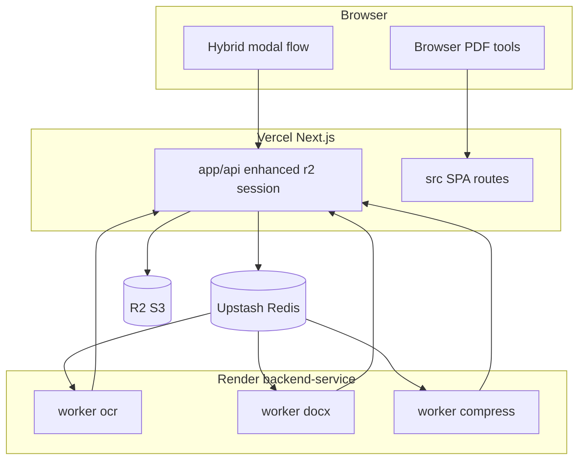

# Architecture after cleanup

Generated: 2026-05-18

```mermaid
flowchart TB
  subgraph client [Browser]
    Tools[Browser PDF tools]
    Hybrid[Hybrid modal flow]
  end
  subgraph vercel [Vercel Next.js]
    API[app/api enhanced r2 session]
    SPA[src SPA routes]
  end
  subgraph render [Render backend-service]
    OCR[worker ocr]
    DOCX[worker docx]
    COMP[worker compress]
  end
  Tools --> SPA
  Hybrid --> API
  API --> Redis[(Upstash Redis)]
  API --> R2[(R2 S3)]
  Redis --> OCR
  Redis --> DOCX
  Redis --> COMP
  OCR --> API
  DOCX --> API
  COMP --> API
```

**Live Premium cloud:** compress-pdf, pdf-to-word, ocr-pdf only.
