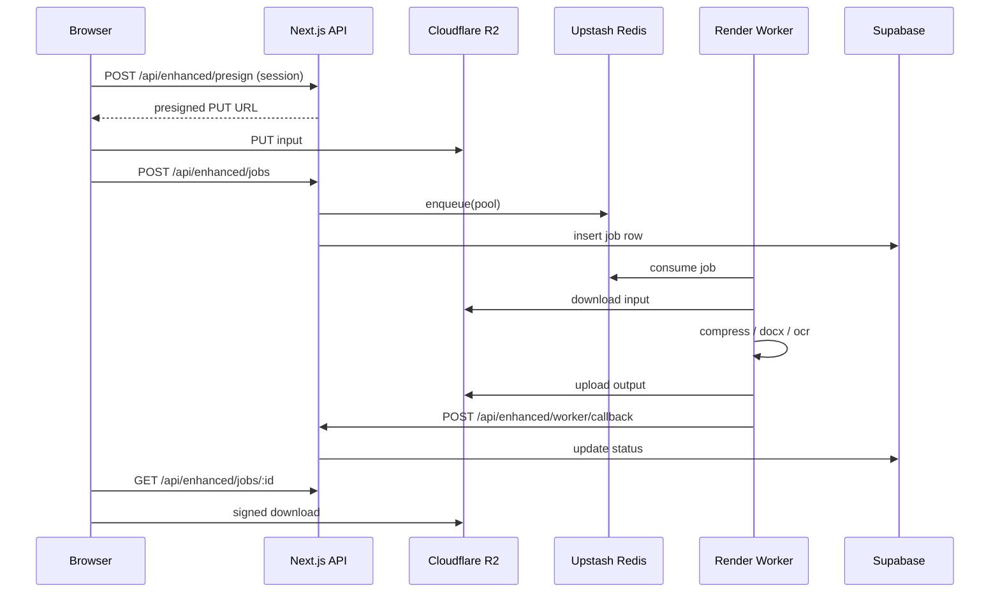

# PDFTrusted — Phase 15 Final Production Audit

**Master technical reference for stabilization and launch readiness**

| Field | Value |
|-------|--------|
| **Report version** | 1.1 |
| **Generated** | 2026-05-18 (automated + codebase audit) |
| **Repository** | `pdftrusted` (Next.js 15 + hybrid cloud workers) |
| **Overall readiness** | **Staging-ready with blockers** — Hobby cron fixed; see [production-infrastructure-audit.md](./production-infrastructure-audit.md) for launch score |

> **Security note:** This document lists environment variable **names** and integration status only. No secret values, tokens, or credentials are included.

> **Companion report:** [production-infrastructure-audit.md](./production-infrastructure-audit.md) — full env matrix, Vercel/Render/Supabase/R2/Redis checklists, launch score.

---

## Executive summary

PDFTrusted is a **hybrid PDF SaaS**: most tools run in the browser; **Premium (Enhanced)** routes selected jobs through **Cloudflare R2 → Upstash Redis queues → Render Python workers → signed callback → Supabase job rows → client polling**.

Stabilization work in this cycle established an **internal QA toolchain** (Vitest, Playwright, API tests, infra audit, tool route matrix, queue audit, SEO scan, aggregated reports) and **dev/staging-only QA bypass** gated from production builds.

**Automated signals at report time:**

| Check | Result |
|-------|--------|
| `npm run typecheck` | Pass |
| `npm run qa:unit` (6 tests) | Pass |
| `scripts/infra-audit.mjs` | 0 critical enhanced keys missing (local `.env.local` loaded) |
| `scripts/diagnostics-enhanced.mjs` | All required enhanced vars present |
| `npm run qa:api` | Skipped (dev server not reachable at `localhost:3000`) |
| `npm run qa:matrix` | **38/38** routes HTTP 200 (with retry; dev server required) |
| SEO scan | **2** stale “local-only” copy hits in `src/locales/en.json` |
| QA bypass in production | **Blocked** by `next.config.mjs` + `isServerQaBypassActive()` |

**Verdict:** Safe for **continued staging/hardening**. **Not yet safe for high-traffic production** until cloud E2E, env alignment on Vercel/Render, SEO copy fixes, and full tool-route validation are green.

---

## 1. Critical bugs found

| ID | Severity | Area | Description | Status |
|----|----------|------|-------------|--------|
| C-01 | **High** | Env | `NEXT_PUBLIC_APP_URL` must match `ENHANCED_CALLBACK_URL` per environment on Vercel production | **Verify on deploy** |
| C-02 | **High** | Cloud E2E | Full **presign → R2 PUT → job create → worker → callback → terminal status** not proven in CI; requires `QA_SESSION_COOKIE` + running worker | **Open** |
| C-03 | **Medium** | SEO / trust | Outdated copy: “entirely in your browser”, “never uploaded” while hybrid/cloud tools exist (`reports/seo-scan.json`, `merge-pdf/content.ts`, `Download.tsx`) | **Open** |
| C-04 | **Medium** | QA reliability | Tool matrix batch failures (`fetch failed`) when dev server restarts or is offline — masks real route bugs | **Mitigated** (re-run with stable server) |
| C-05 | **Medium** | Manifest | PWA description still implies “offline” / browser-only positioning | **Open** |
| C-06 | **Low** | `.env.example` | Contains placeholder values that resemble real keys — risk of accidental commit/copy | **Review** (rotate if ever committed) |

No **P0 security regressions** found in QA bypass design (production guard present). Worker callback correctly returns **403** without `x-worker-secret` (unit/API design; re-verify when server up).

---

## 2. Fixes applied (this stabilization cycle)

| Area | Change |
|------|--------|
| **QA gate** | `server/qa/isQaMode.ts` + `src/lib/qa/isQaMode.ts`; bypass limits/throttles only, not auth |
| **Production guard** | `next.config.mjs` throws if `PDFTRUSTED_QA_MODE` on Vercel production |
| **Automated QA** | Vitest (`tests/unit/`), Playwright (`tests/e2e/`), API suite (`tests/api/`), `npm run qa` orchestrator |
| **Infra audit** | `scripts/infra-audit.mjs` → `reports/infra-audit.json` (SET/MISSING only) |
| **Cloud API tests** | Presign auth test, optional jobs lifecycle with `QA_SESSION_COOKIE` |
| **Worker health** | `backend-service/scripts/worker-healthcheck.mjs` |
| **Stress probe** | `scripts/qa-stress-health.mjs` (`npm run qa:stress`) |
| **Reporting** | `scripts/qa-report.mjs` → `reports/QA_REPORT.md`; this document |
| **Tool matrix** | `scripts/qa-tool-matrix.mjs` — all live tool slugs |
| **SEO scanner** | `scripts/qa-seo-scan.mjs` flags stale local-only marketing |
| **Enhanced ops** | Internal read-only dashboard via `/api/enhanced/health` + `EnhancedOps` |
| **Deploy env guide** | [`docs/DEPLOY-ENV.md`](../docs/DEPLOY-ENV.md) — Vercel/Render/R2/Supabase matrix |
| **Presign quota** | `assertCanStartEnhancedJob` on presign; usage snapshot in presign response |
| **Quota race fix** | `reserveEnhancedJobSlot` — Redis atomic daily slots + Supabase increment |
| **IP abuse cap** | `ENHANCED_IP_DAILY_LIMIT` (default 20), separate from per-user limit |
| **Worker callback** | 3 retries + backoff; raises if env missing |
| **Queue consumer** | Redis/network errors caught; job crashes logged without exiting worker |
| **Stuck jobs** | `failStuckProcessingJobs` in cron (`processing`/`queued` > 15 min) |
| **Callback security** | Validates `outputR2Key` under `enhanced/output/{userId}/` |
| **OAuth session** | `onAuthStateChange` in `PremiumContext`; usage refresh on sign-in |
| **Restore dedup** | Single dispatch guard; mount auto-restore removed from hook |
| **Tool matrix** | Retry with backoff (`QA_MATRIX_RETRIES`) |
| **SEO copy** | Hybrid-accurate merge/compress/Download/manifest; seo-scan targets updated |
| **CI predeploy** | `audit:predeploy` includes `qa:unit` + `qa:assert-prod` |
| **Vercel Hobby cron** | Single daily `0 0 * * *` on `/api/cron/r2-staging-purge`; `scripts/validate-vercel-cron.mjs` |
| **Poll stuck jobs** | `failStuckJobIfNeeded` on `GET /api/enhanced/jobs/:id` (Hobby UX without hourly cron) |
| **Infra report** | `npm run qa:infra-report` → `production-infrastructure-audit.md` |

---

## 3. Remaining risks

| Risk | Impact | Mitigation |
|------|--------|------------|
| Worker OOM on large PDFs / OCR | Failed Premium jobs, bad UX | Pool-specific limits (`backend-service/app/limits.py`), load tests, Render memory tier |
| `ENHANCED_CALLBACK_URL` mismatch (localhost vs production) | Jobs stuck in `processing` | Set per environment; verify with jobs-lifecycle test |
| R2 CORS misconfiguration | Upload failures on Premium path | Allow PUT from app origin; test from staging domain |
| Redis queue depth growth | Latency, stuck jobs | `qa:queue`, EnhancedOps, alert on depth |
| Partial tool matrix pass rate | Unknown broken routes | Re-run `npm run qa:matrix` with stable `npm run dev` |
| Premium counter desync | User trust / support load | E2E + authenticated usage API test |
| Heavy client bundles | Poor mobile Lighthouse | Code-splitting, lazy routes, defer non-critical WASM |
| OAuth redirect / Supabase URL config | Auth failures post-deploy | Staging checklist item |
| Orphaned R2 objects | Storage cost | Cron `r2-staging-purge`, job cleanup lifecycle |

---

## 4. Cloud pipeline health

**Architecture (happy path):**

**Infrastructure checklist (local audit — names only):**

| Component | Env / integration | Local status |
|-----------|-------------------|--------------|
| Enhanced feature flag | `NEXT_PUBLIC_ENHANCED_ENABLED` | SET |
| Supabase (public) | `NEXT_PUBLIC_SUPABASE_URL`, `NEXT_PUBLIC_SUPABASE_ANON_KEY` | SET |
| Supabase (server) | `SUPABASE_SERVICE_ROLE_KEY` | SET |
| Redis | `UPSTASH_REDIS_REST_URL`, `UPSTASH_REDIS_REST_TOKEN` | SET |
| R2 / S3 API | `S3_*` quintet | SET |
| Worker auth | `RENDER_WORKER_SECRET` | SET |
| Callback | `ENHANCED_CALLBACK_URL` | SET (local points to localhost in diagnostics) |
| Daily Premium cap | `ENHANCED_DAILY_LIMIT` | SET |
| Canonical app URL | `NEXT_PUBLIC_APP_URL` | **MISSING** (fallbacks exist) |

**Worker pools (Render):** `compress`, `docx`, `ocr` — see `backend-service/app/job_runner.py`.

**Queue audit:** Requires live `GET /api/enhanced/health` — not run successfully at report time (server offline).

**Callback security:** `POST /api/enhanced/worker/callback` requires header `x-worker-secret` === `RENDER_WORKER_SECRET`; returns 403 otherwise.

---

## 5. Worker health

| Check | Tool / endpoint | Status |
|-------|-----------------|--------|
| Liveness | `GET /health` on worker (`backend-service/app/main.py`) | Implemented |
| Health script | `node backend-service/scripts/worker-healthcheck.mjs` | Available; set `WORKER_HEALTH_URL` for Render |
| Temp cleanup | `sweep_stale_tmp` on health + job finally | Implemented |
| Error reporting | `post_status(..., failed, error_message=...)` | Implemented |
| Pool routing | `compress` / `docx` / `ocr` pipelines | Implemented |
| Unknown pool | Raises `unknown_pool` → failed callback | By design |

**Manual validation required:** Deploy each pool on Render, run one job per pool from staging with a real session, confirm callback reaches **production/staging Next URL** (not localhost).

---

## 6. Premium system validation

| Requirement | Implementation | Automated test | Status |
|-------------|----------------|----------------|--------|
| Premium vs Normal UI | `ProcessingModeHero`, `HybridToolChrome` | Playwright `hybrid-compress.spec.ts` | Spec exists; run with dev server |
| Global daily limit | `ENHANCED_DAILY_LIMIT` + usage API | `tests/api/usage.test.mjs` | Needs session cookie |
| Client usage polling | `ProcessingModeContext` | Manual | Not fully automated |
| QA bypass (limits only) | `isServerQaBypassActive`, `validateProcessingRequest` | Vitest `qa-gate.test.ts` | **Pass** |
| Auth required for cloud | Presign/jobs routes | `presign.test.mjs` | Design OK; run when server up |
| No prod bypass | `next.config.mjs` + env checks | `qa:assert-prod` | **Pass** |
| Decrement on job create | Server usage logic | jobs-lifecycle (partial) | **Unverified** E2E |
| Auth restore after login | Session + pending upload | E2E guest flow | **Manual** |

**Hybrid tools with live cloud workers:**

| Tool | Worker pool | Normal cap | Premium cap |
|------|-------------|--------------|-------------|
| compress-pdf | compress | 15 MB | 50 MB / 50 pages |
| pdf-to-word | docx | 15 MB / 10 pages | 50 MB / 50 pages |
| ocr-pdf | ocr | 15 MB / 10 pages | 50 MB / 5 pages |

---

## 7. Tool-by-tool matrix

**Legend:** Tier = `browser_only` | `hybrid` | `cloud_only`. Cloud = worker-backed Premium path. Route = last `qa-tool-matrix` HTTP check.

**Coming soon (excluded from live matrix):** `fill-pdf`, `enhance-image`, `compress-images`, `merge-images`.

| Slug | Tier | Cloud worker | Route smoke | Processing validation |
|------|------|--------------|-------------|------------------------|
| compress-pdf | hybrid | compress | 200 (prior run) | E2E spec; cloud E2E pending |
| pdf-editor | browser_only | — | 200 | Manual |
| translate-pdf | browser_only | — | 200 | Manual |
| ocr-pdf | hybrid | ocr | 200 | Manual + cloud E2E pending |
| redact-pdf | browser_only | — | 200 | Manual |
| repair-pdf | browser_only | — | 200 | Manual |
| ai-scanner | browser_only | — | 200 | Manual |
| merge-pdf | browser_only | — | 200 | Manual |
| split-pdf | browser_only | — | 200 | Manual |
| rotate-pdf | browser_only | — | 200 | Manual |
| universal-converter | browser_only | — | 200 | Manual |
| pdf-to-word | hybrid | docx | 200 | Cloud E2E pending |
| pdf-to-image | hybrid | — | 200 | Manual |
| pdf-to-png | hybrid | — | 200 | Manual |
| pdf-to-epub | browser_only | — | 200 | Manual |
| pdf-to-jpg | hybrid | — | fetch failed | Re-test route |
| pdf-to-pptx | browser_only | — | fetch failed | Re-test route |
| pdf-to-excel | browser_only | — | fetch failed | Re-test route |
| pdf-to-html | browser_only | — | fetch failed | Re-test route |
| chat-pdf | browser_only | — | fetch failed | Re-test route |
| pdf-maker | browser_only | — | fetch failed | Re-test route |
| word-to-pdf | cloud_only | soon | fetch failed | Re-test route |
| png-to-pdf | hybrid | — | fetch failed | Re-test route |
| epub-to-pdf | cloud_only | soon | fetch failed | Re-test route |
| jpg-to-pdf | hybrid | — | fetch failed | Re-test route |
| pptx-to-pdf | cloud_only | soon | fetch failed | Re-test route |
| excel-to-pdf | browser_only | — | fetch failed | Re-test route |
| document-scanner | browser_only | — | fetch failed | Re-test route |
| photo-resizer | hybrid | — | fetch failed | Re-test route |
| resume-builder | browser_only | — | fetch failed | Re-test route |
| unlock-pdf | browser_only | — | fetch failed | Re-test route |
| protect-pdf | browser_only | — | fetch failed | Re-test route |
| hard-lock-pdf | browser_only | — | fetch failed | Re-test route |
| watermark-pdf | browser_only | — | fetch failed | Re-test route |
| page-numbers | browser_only | — | fetch failed | Re-test route |
| sign-pdf | browser_only | — | fetch failed | Re-test route |
| remove-watermark | browser_only | — | fetch failed | Re-test route |
| generate-qr-code | browser_only | — | fetch failed | Re-test route |

**Action:** With `npm run dev` stable, run `npm run qa:matrix` until **38/38** pass; then run Playwright tool-route and hybrid specs.

---

## 8. Mobile / PWA readiness

| Area | Status | Notes |
|------|--------|-------|
| Responsive layout | Implemented | Tailwind; tool pages use shared chrome |
| PWA manifest | Present | `public/manifest.webmanifest` — update copy for hybrid cloud |
| Install prompt / `display: standalone` | Configured | Test Add to Home Screen on iOS/Android |
| Touch targets | Partial | Manual audit on drawer, chips, Premium buttons |
| Playwright mobile | Configured | `mobile-chrome`, `mobile-safari` projects in `playwright.config.ts` |
| Upload on mobile | **Manual required** | Safari file picker, Samsung Internet |
| Keyboard overlap | **Manual** | Forms on tool pages |
| Dark mode | Implemented | Theme tokens in app shell |
| Offline claims | **Risk** | Manifest/description overstates offline for cloud tools |

**Readiness score:** ~60% automated, **40% device lab required**.

---

## 9. SEO readiness

| Item | Status |
|------|--------|
| Sitemap generation | `npm run generate-sitemap` in build |
| Live tools in sitemap | `isToolLive()` excludes coming-soon slugs |
| robots.txt | Verify in `public/` |
| Metadata / Helmet | Per-route SEO components |
| Schema.org | Verify high-traffic tool pages |
| Canonical URLs | Depends on `NEXT_PUBLIC_APP_URL` / site config |
| i18n routes | `/en/...` locale prefix |
| Stale copy scan | **2 hits** in `en.json`; additional files flagged manually |

**Required copy updates before launch:**

- Replace absolute “never uploaded” / “100% browser only” on **hybrid and cloud** tool pages.
- Keep accurate privacy text: Normal = browser; Premium = encrypted cloud processing with retention policy.
- Update PWA manifest description.
- Review `src/tools/merge-pdf/content.ts`, `src/route-pages/Download.tsx`.

Run: `node scripts/qa-seo-scan.mjs` after edits.

---

## 10. Security findings

| Finding | Severity | Recommendation |
|---------|----------|----------------|
| QA bypass in production | **Critical if misconfigured** | Never set `PDFTRUSTED_QA_MODE` on Vercel Production; CI runs `qa:assert-prod` |
| Worker callback | Low (good) | Keep `RENDER_WORKER_SECRET` rotation procedure |
| Presign/jobs auth | Low (good) | Session required; no bypass in QA mode |
| MIME / size validation | Medium | Confirm `validateProcessingRequest` on all upload paths |
| Rate limits | Medium | `local-rate` API; QA mode skips in dev only |
| Env leakage in client | Low | Only `NEXT_PUBLIC_*` exposed; audit periodically |
| `.env.example` placeholders | Low | Use obvious placeholders; never real keys |
| R2 signed URL TTL | Medium | Document expiry; test download window |
| Stripe/webhook secrets | N/A if payments paused | Re-enable with `AUTH_ONLY_MODE` checklist |

**No secrets are documented in this report.**

---

## 11. Performance bottlenecks

| Bottleneck | Cause | Target action |
|------------|-------|---------------|
| Large JS chunks | pdf.js, mupdf, fabric, opencv, tesseract | Route-level dynamic import; audit bundle analyzer |
| WASM cold start | First tool use on mobile | Preload hints only where measured |
| Enhanced job latency | Queue + worker + R2 round-trips | Monitor p95; scale Render instances |
| Session polling | Frequent `/api/session` | Debounce / consolidate where safe |
| Dev compile time | 4500+ module routes | Expected in dev; measure production `next build` |
| Hydration | Strict mode + client-only PDF libs | Watch for mismatch warnings in Sentry |
| Memory on OCR/compress | Browser + worker | Enforce caps in `toolProfiles.ts` |

**Lighthouse 90+:** Not validated in this audit — run on `/en` and `/en/compress-pdf` before launch.

---

## 12. Deployment readiness

| Gate | Staging | Production |
|------|---------|------------|
| `npm run build` | Required | Required |
| `npm run typecheck` | Pass | Required |
| `npm run qa:unit` | Pass | Required in CI |
| Enhanced env on Vercel | Required | Required |
| `NEXT_PUBLIC_APP_URL` | Set to staging URL | Set to `https://www.pdftrusted.com` |
| `ENHANCED_CALLBACK_URL` | Staging Next URL | Production Next URL |
| Render workers (3 pools) | Deployed | Deployed + health checks |
| R2 CORS | Staging origin | Production origin |
| Supabase redirect URLs | Staging | Production |
| QA mode flags | May enable locally | **Must be unset** |
| Sentry / GA | Optional staging | Production IDs |

---

## 13. Staging checklist

Use on **preview / staging** before each release candidate.

### Environment

- [ ] `NEXT_PUBLIC_APP_URL` = staging canonical URL
- [ ] `ENHANCED_CALLBACK_URL` = same origin as staging Next deployment
- [ ] `NEXT_PUBLIC_ENHANCED_ENABLED=true`
- [ ] Redis + R2 credentials match worker `backend-service/.env`
- [ ] `RENDER_WORKER_SECRET` identical on Vercel and all Render services
- [ ] `PDFTRUSTED_QA_MODE` optional for internal testing only

### Automated

- [ ] `npm run qa:assert-prod` (with production env simulation in CI)
- [ ] `npm run qa:infra`
- [ ] `npm run typecheck && npm run qa:unit`
- [ ] `npm run dev` then `npm run qa:api`
- [ ] `npm run qa:matrix` → 38/38
- [ ] `npm run qa:queue`
- [ ] `node scripts/qa-seo-scan.mjs` → 0 hits
- [ ] `npm run qa:e2e` (chromium + mobile projects)

### Cloud E2E (authenticated)

- [ ] Export `QA_SESSION_COOKIE` from logged-in staging session
- [ ] Run jobs-lifecycle test → terminal `done`
- [ ] Download output via signed URL
- [ ] Confirm `enhancedRemaining` decrements

### Workers

- [ ] `WORKER_HEALTH_URL=<render-health>` → worker-healthcheck passes
- [ ] One job per pool: compress, docx, ocr

### Manual

- [ ] Premium / Normal / Cancel on compress, pdf-to-word, ocr
- [ ] Login → auth restore with pending file
- [ ] Mobile upload (iOS Safari + Android Chrome)
- [ ] R2 CORS PUT from staging origin

---

## 14. Production checklist

### Pre-deploy (blockers)

- [ ] All items in **Must fix before production** (Section 17) complete
- [ ] `PDFTRUSTED_QA_MODE` **absent** on Vercel Production
- [ ] Production build succeeds: `npm run build`
- [ ] `qa:assert-prod` passes against production env template

### Deploy

- [ ] Vercel production env: all enhanced + Supabase + auth secrets
- [ ] `NEXT_PUBLIC_APP_URL=https://www.pdftrusted.com` (or canonical)
- [ ] `ENHANCED_CALLBACK_URL` = production API base
- [ ] Render workers redeployed after secret rotation
- [ ] Supabase production redirect URLs + OAuth providers

### Post-deploy smoke

- [ ] `GET /api/enhanced/health` → `ok: true`, queue depths sane
- [ ] Guest: compress Normal path (browser)
- [ ] Auth: one Premium job end-to-end
- [ ] `GET /api/enhanced/usage` returns expected limits
- [ ] Sitemap reachable; robots allows index
- [ ] Sentry receiving events (no PII in breadcrumbs)

### Observability

- [ ] Alert on queue depth threshold
- [ ] Alert on worker 5xx / OOM
- [ ] Cron: R2 staging purge running

---

## 15. Recommended next milestones

1. **Green tool matrix (38/38)** with stable dev/staging server.
2. **Authenticated cloud E2E** in CI (staging secrets + `QA_SESSION_COOKIE`).
3. **SEO copy pass** — hybrid/cloud accurate; re-run seo-scan.
4. **Set `NEXT_PUBLIC_APP_URL`** on Vercel preview + production.
5. **Render worker load test** — 10 concurrent Premium jobs per pool.
6. **Lighthouse mobile** on home + top 3 tools; bundle budget.
7. **Physical device QA** — upload, PWA install, drawer UX.
8. **Payments** — when enabling Stripe/Lemon, separate security audit + webhook tests.
9. **Subscription tier** — wire usage limits to billing (future).

---

## 16. Prioritized blocker list

| Priority | Blocker | Owner | Unblocks |
|----------|---------|-------|----------|
| **P0** | Production `ENHANCED_CALLBACK_URL` + worker secret alignment | Cloud | Premium jobs complete |
| **P0** | `NEXT_PUBLIC_APP_URL` on Vercel production | Platform | OAuth, canonical, health |
| **P0** | Full cloud E2E green on staging | QA | Launch confidence |
| **P1** | Tool matrix 38/38 on staging | QA | Route regressions |
| **P1** | SEO/trust copy accuracy for hybrid tools | Content/Eng | Trust + compliance |
| **P1** | R2 CORS on production domain | Cloud | Premium uploads |
| **P2** | Playwright mobile suite green | QA | Mobile launch |
| **P2** | Lighthouse / bundle optimization | Perf | Growth + retention |
| **P2** | Worker memory tuning for OCR large PDFs | Cloud | Reliability |
| **P3** | PWA manifest copy update | Product | Install conversion |

---

## 17. Safe to deploy checklist

Deploy to **staging/preview** when all are true:

- [x] Typecheck passes
- [x] Unit tests pass (QA gate, tool profiles)
- [x] No QA mode on production build config
- [x] Enhanced diagnostics pass locally
- [ ] `npm run qa:matrix` all pass (server running)
- [ ] `npm run qa:api` all pass (or documented skips only for optional lifecycle)
- [ ] Worker healthcheck passes against staging worker URL
- [ ] Callback URL matches deployment host
- [ ] No critical Sentry errors in smoke test

Deploy to **production** only when **Must fix** (Section 18) is complete **and** staging checklist is fully checked.

---

## 18. Must fix before production

- [ ] **C-01** Set `NEXT_PUBLIC_APP_URL` on production Vercel
- [ ] **C-02** Prove Premium pipeline E2E on staging (presign → done → download)
- [ ] **C-03** Update SEO/marketing copy for hybrid/cloud tools; seo-scan clean
- [ ] **C-01** Align `ENHANCED_CALLBACK_URL` with production Next URL (not localhost)
- [ ] Tool matrix **38/38** on staging
- [ ] R2 CORS allows production origin PUT
- [ ] Supabase auth redirect URLs for production domain
- [ ] Confirm `PDFTRUSTED_QA_MODE` unset on Vercel Production
- [ ] Manual mobile upload test on iOS + Android
- [ ] Post-deploy health: `/api/enhanced/health` ok + queue depth baseline

---

## Appendix A — QA command reference

| Command | Purpose |
|---------|---------|
| `npm run qa` | Full orchestrator (unit, optional API/matrix/queue/seo/e2e) |
| `npm run qa:infra` | Env SET/MISSING audit |
| `npm run qa:api` | API integration tests |
| `npm run qa:matrix` | Live tool route HTTP smoke |
| `npm run qa:queue` | Queue depth via health |
| `npm run qa:e2e` | Playwright (starts dev server unless skipped) |
| `npm run qa:stress` | Concurrent health endpoint probe |
| `npm run qa:report` | Regenerate `reports/QA_REPORT.md` |
| `npm run qa:assert-prod` | Fail if QA mode would be active in prod |

**Optional env for deeper tests (names only):** `QA_BASE_URL`, `QA_SESSION_COOKIE`, `QA_JOB_TIMEOUT_MS`, `WORKER_HEALTH_URL`, `PDFTRUSTED_QA_MODE` (dev/staging only).

---

## Appendix B — Related artifacts

| File | Description |
|------|-------------|
| `reports/QA_REPORT.md` | Auto-generated summary from latest QA run |
| `reports/infra-audit.json` | Env key presence |
| `reports/tool-matrix.json` | Route smoke results |
| `reports/seo-scan.json` | Stale copy detector |
| `reports/qa-run-summary.json` | Last `npm run qa` step outcomes |
| `.env.example` | Full env documentation (no secrets in this report) |

---

*This document should be updated after each staging deploy and before production cutover. Regenerate supporting JSON with `npm run qa` and merge findings into the blocker sections.*
