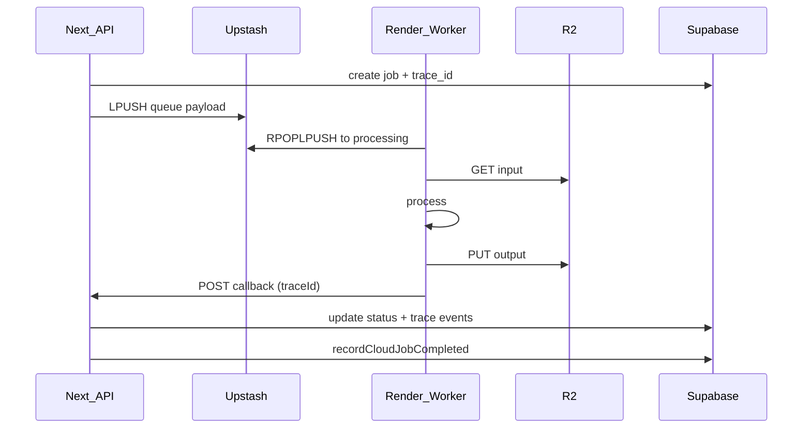

# Render worker flow

Generated: 2026-05-18

## Reliability
- Max 3 attempts per job (Redis `enhanced:attempts:{jobId}`)
- Dead letter list `enhanced:dead:{pool}`
- Cron requeues orphaned processing entries (15m)
